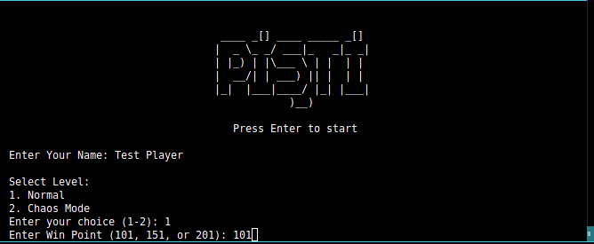
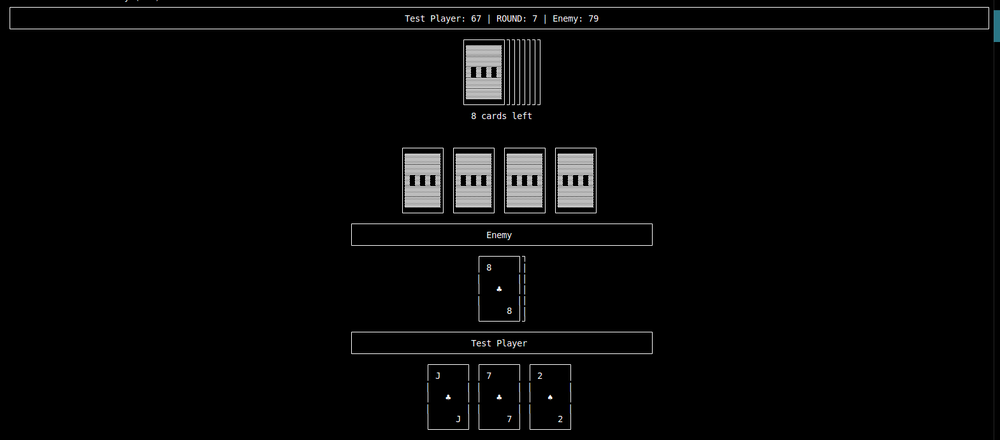
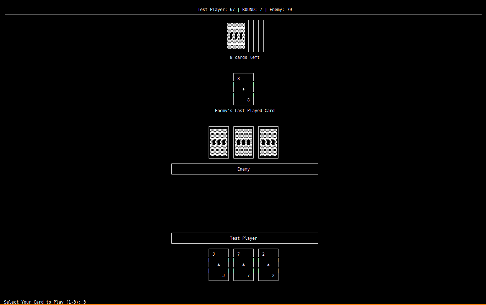
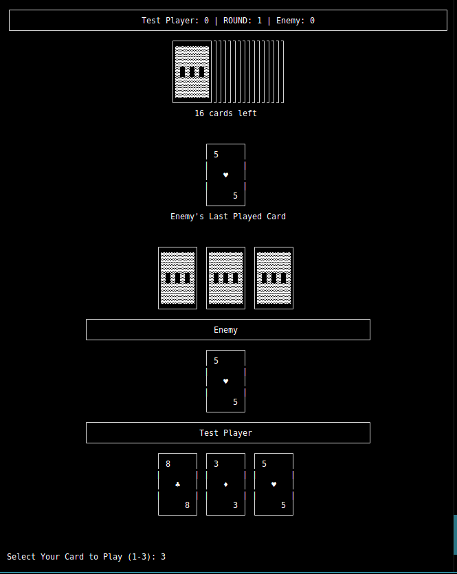
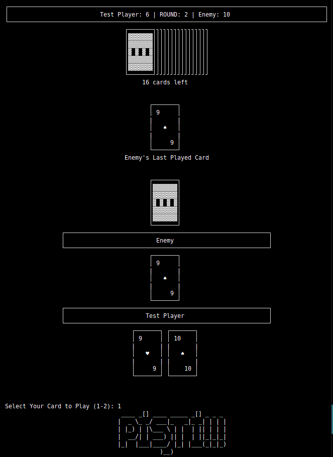
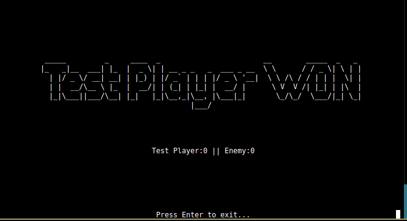

# 🃏 Pişti Card Game

A terminal-based implementation of the traditional Turkish card game Pişti, featuring a rule-based AI opponent with strategic decision-making.

## 📖 About Pişti

Pişti is a popular Turkish card game where players try to match cards and collect points. The game involves strategy, luck, and trust in your memory. This implementation brings the classic game to your terminal with background music and sound effects.

## 🎮 Screenshots

### Main Menu


### Gameplay





### Victory Screen


## ✨ Features

- 🤖 **Rule-Based AI Opponent** - Strategic computer player using intelligent decision-making algorithms:
  - Prioritizes matching cards on the table
  - Analyzes visible cards to make optimal plays
  - Avoids risky moves (like playing Jack on empty table)
  - Uses frequency analysis to play strategically
  
- 🎵 **Background Music** - Continuous music playback during gameplay
- 🔊 **Sound Effects** - Win/lose/draw sound effects

- 🎯 **Two Difficulty Modes**
  - **Normal Mode**: Standard Pişti rules with customizable win points
  - **Chaos Mode**: 13 random cards become '5' cards for unpredictable gameplay
  
- 🏆 **Multiple Win Conditions** - Choose from 101, 151, or 201 point targets (Normal mode)

- 🎴 **Traditional Pişti Rules**
  - Match cards to collect points
  - Pişti bonus (10 pts) when only 2 cards on table
  - Jack (J) as wild card
  - **⚡ 5-5 Pişti**: Instant win when matching two 5s
  
- 📊 **Score Tracking** - Real-time score display and round tracking
- 🎨 **ASCII Card Graphics** - Visual card representation in terminal

## 📋 How to Play

### Basic Rules
1. Players take turns playing cards from their hand (4 cards each round)
2. Match the rank of the top table card to collect all cards on the table
3. **Pişti**: Matching when only 2 cards on table = bonus points (10 pts)
4. **Jack (J)**: Wild card - collects all table cards regardless of rank
5. **Jack Pişti**: Matching two Jacks when only 2 cards on table = double bonus (20 pts)
6. **⚡ 5-5 Pişti**: Matching two 5s = INSTANT VICTORY! Game ends immediately

### AI Strategy
The computer opponent uses a rule-based algorithm that:
- Attempts to match the table card first
- Evaluates card frequency from visible cards
- Avoids playing valuable cards (like Jack) on empty tables
- Makes strategic decisions based on game state

### Scoring
- Each Pişti: 10 points
- Jack Pişti: 20 points
- Aces (A): 1 point each
- Jacks (J): 1 point each
- 10 of Diamonds (♦): 3 points
- 2 of Clubs (♣): 2 points
- Collecting most cards in a round: 3 bonus points
- **5-5 Match: Instant Win!**

## 🛠️ Installation

### Prerequisites
- Python 3.7 or higher
- pip (Python package manager)

### Required Libraries
```bash
pip install pygame pyfiglet
```

### Setup
1. Clone or download this repository
2. Make sure you have the required files:
   - `project.py` (main game file)
   - `deck.csv` (card data)
   - `musics/` folder (with .mp3 files for background music)
   - `sound_effects/` folder (with win.mp3, lose.mp3, draw.mp3)

## 🚀 How to Run

1. Navigate to the project directory:
```bash
cd path/to/pisti-card-game
```

2. Run the game:
```bash
python main.py
```

3. Follow the on-screen prompts:
   - Enter your name (letters only)
   - Select difficulty mode (1 for Normal, 2 for Chaos Mode)
   - Choose win point (101, 151, or 201) - Normal mode only
   - Select cards using numbers (1-4 corresponding to your hand)

## 📁 Project Structure

```
pisti-card-game/
├── main.py              # Main game logic
├── deck.csv                # Card definitions and point values
├── README.md               # This file
├── musics/                 # Background music files
│   └── *.mp3
├── sound_effects/          # Game sound effects
│   ├── win.mp3
│   ├── lose.mp3
│   └── draw.mp3
└── screenshots/            # Game screenshots
    ├── main_menu_screen.png
    ├── in-game1.png
    ├── in-game2.png
    ├── in-game3.png
    ├── in-game4.png
    └── win_screen.png
```

## 💻 Technologies Used

- **Python 3.x** - Core programming language
- **Pygame** - Music and sound management
- **Pyfiglet** - ASCII art text generation for titles
- **CSV** - Card data storage and management
- **Threading** - Background music playback without blocking gameplay
- **Collections (Counter)** - AI decision-making and card frequency analysis
- **Shutil** - Terminal size detection for centered output

## 🎓 What I Learned

Building this project as my first Python game taught me:

- **Object-Oriented Programming**: Designing classes (GameActions, Printer) and managing complex game state
- **Game Logic Implementation**: Translating traditional card game rules into code with proper win conditions
- **Rule-Based AI Algorithm Design**: Creating strategic decision-making for computer opponent using card frequency analysis
- **Multi-threading**: Running background music without blocking main gameplay loop
- **File I/O & Error Handling**: Reading CSV data safely and managing music files with proper exception handling
- **User Input Validation**: Ensuring robust input handling for names, numbers, and game choices
- **Terminal UI Design**: Creating an engaging ASCII-based interface with card graphics
- **Game State Management**: Tracking turns, scores, rounds, and collections efficiently
- **Code Organization**: Separating concerns between game logic and display logic

### Challenges Overcome
- Implementing Pişti rules correctly, especially the instant-win 5-5 condition
- Designing AI that makes intelligent decisions based on visible cards
- Managing complex game state across multiple rounds
- Coordinating background music with game flow

## 📈 Potential Improvements

- [ ] Multiplayer support (local or online)
- [ ] Save/load game functionality
- [ ] Statistics tracking across multiple games
- [ ] More difficulty levels for AI
- [ ] Undo move functionality

## 👤 Author

**Okan Can Nazlı**
- GitHub: [@okan-can-nazli](https://github.com/okan-can-nazli)

## 📄 License

This project is open source and available under the [MIT License](LICENSE).

## 🙏 Acknowledgments

- Traditional Turkish Pişti card game and its cultural heritage
- Turkish card game community
- Python and Pygame communities for excellent documentation

---

**Enjoy playing Pişti! 🃏**